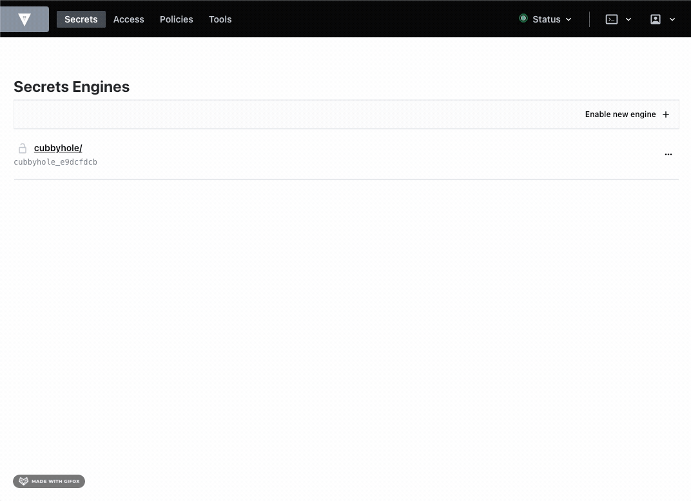

## Vault

O [Vault](https://www.vaultproject.io/) é uma ferramenta desenvolvida pela [HashiCorp](https://www.hashicorp.com/) com objetivo de auxiliar na gestão de secrets e proteção de dados sensíveis.    
Utilizaremos o [Vault Helm Chart](https://github.com/hashicorp/vault-helm) para instalação e configuração do Vault em um cluster Kubernetes, conforme a recomendação oficial.   

### Requirements
- [Helm](https://helm.sh/docs/intro/install/)
- [Cluster Kubernetes](https://docs.aws.amazon.com/eks/latest/userguide/create-kubeconfig.html)
- [Credenciais AWS KMS](https://docs.aws.amazon.com/kms/latest/developerguide/overview.html)
- [Vault CLI](https://www.vaultproject.io/docs/install)

### Installation Steps
#### Setup
Por padrão o Vault necessita ser aberto (unseal) manualmente todas as vezes que for iniciado, o que pode ocorrer com muita frequência quando executado em um cluster Kubernetes. Desta forma, vamos configurá-lo para executar o unseal automaticamente utilizando o [AWS KMS](https://aws.amazon.com/en/kms/).   
Primeiramente, faça uma cópia do arquivo modelo [values.yaml](values/values.yaml) e renomeie de acordo com o ambiente desejado, para QA por exemplo foi criado o arquivo [values-QA.yaml](values/values-QA.yaml). Agora, neste arquivo que você acabou de criar, atualize as informações de acesso ao KMS (KMS_REGION e KMS_KEY_ID)   

No cluster kubernetes, crie uma Secret com as credenciais para o Vault acessar o KMS   
```bash
# create vault namespace
$ kubectl create ns vault
# create secret
$ kubectl create secret generic eks-creds \
    --from-literal=AWS_ACCESS_KEY_ID="${AWS_ACCESS_KEY_ID?}" \
    --from-literal=AWS_SECRET_ACCESS_KEY="${AWS_SECRET_ACCESS_KEY?}"
```

#### Installing
A instalação do Vault será feita no modo standalone, que possibilita executarmos uma única instância do Vault com armazenamento das secrets em uma estrutura de diretórios no filesystem local da instância. Caso necessite instalar o Vault em alta disponibilidade veja as instruções [aqui](https://www.vaultproject.io/docs/platform/k8s/helm/run#ha-mode).   

```bash
# o primeiro passo é configurar o repositório Vault Helm Chart
$ helm repo add hashicorp https://helm.releases.hashicorp.com
# agora vamos instalar o Vault utilizando o arquivo de configuração que acabamos de criar:
$ helm install vault hashicorp/vault -f ./values/values-<ENVIRONMENT>.yaml --namespace vault
# se tudo ocorrer bem, os componente do Vault serão criados no namespace vault, verifique os pods em execução:
$ kubectl get pods --namespace vault
# assim que o Pod do Vault estiver com status running, vamos inicializar o Vault
$ kubectl exec -ti vault-0 -- vault operator init
# OBS: o comando acima exibirá o seu *Initial Root Token* (algo como: s.LqIjL7WuWiy69mOiEizfmats), ele será necessário para acessar a interface gráfica
# Por fim, é possível verificar o status de execução para confirmar se o unseal foi executado com sucesso:
$ kubectl exec -ti vault-0 -- vault status
```
#### Enable Secret Engine
O Vault disponibiliza diversas engines que podem ser utilizadas para armazenamento de secrets, cada uma com seus respectivos conjuntos de APIs e métodos. Para o cenário atual, vamos habilitar a Key Value Engine. Execute o comando abaixo e então acesse o endereço http://127.0.0.1:8200/ui em seu navegador
```bash
$ kubectl port-forward svc/vault 8200
```
Na tela de autenticação, selecione o método *Token* e insira o *Initial Root Token*. Em seguida habilite o KV Engine seguindo os passos:


#### Unistall
Para remover o Vault basta executar 
```bash
$ helm uninstall vault
```
Por padrão o Vault Helm cria um volume para persistência de dados, mas durante o processo de uninstall estes discos não são removidos. Vejamos em como remover em definitivo
```bash
# check existing PVCs
$ kubectl get pvc --namespace vault
# delete PVC
$ kubectl delete pvc data-vault-0 --namespace vault
# delete namespace
$ kubectl delete ns vault
```

### How to use
#### Using Vault Cli
É possível adicionar uma secret utilizando o Vault Cli, para isso, vamos exportar as seguintes credenciais:
```bash
$ export VAULT_ADDR='http://127.0.0.1:8200'
# exportar initial root token
$ export VAULT_TOKEN="s.17uoj6vR410VfKuFOvVXQD4M"
# validar se o Vault está running
$ vault status
# para criar a primeira secret, utilizamos o comando *put*
$ vault kv put kv/legiti target=fraudless
# com o comando get, é possível recuperar os dados salvos
$ vault kv get kv/legiti
# por fim, vamos remover a secret
$ vault kv delete kv/legiti
```
#### HTTP API
As APIs HTTP permitem o acesso a todos os recursos do Vault. Inclusive, a comunicação entre vault cli e server é feita por meio destas mesmas APIs.